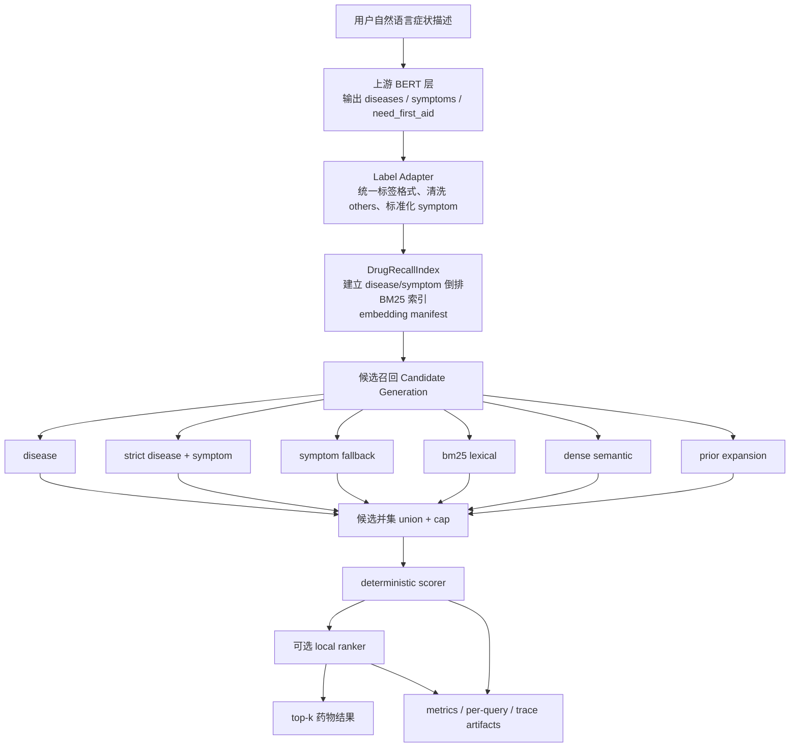
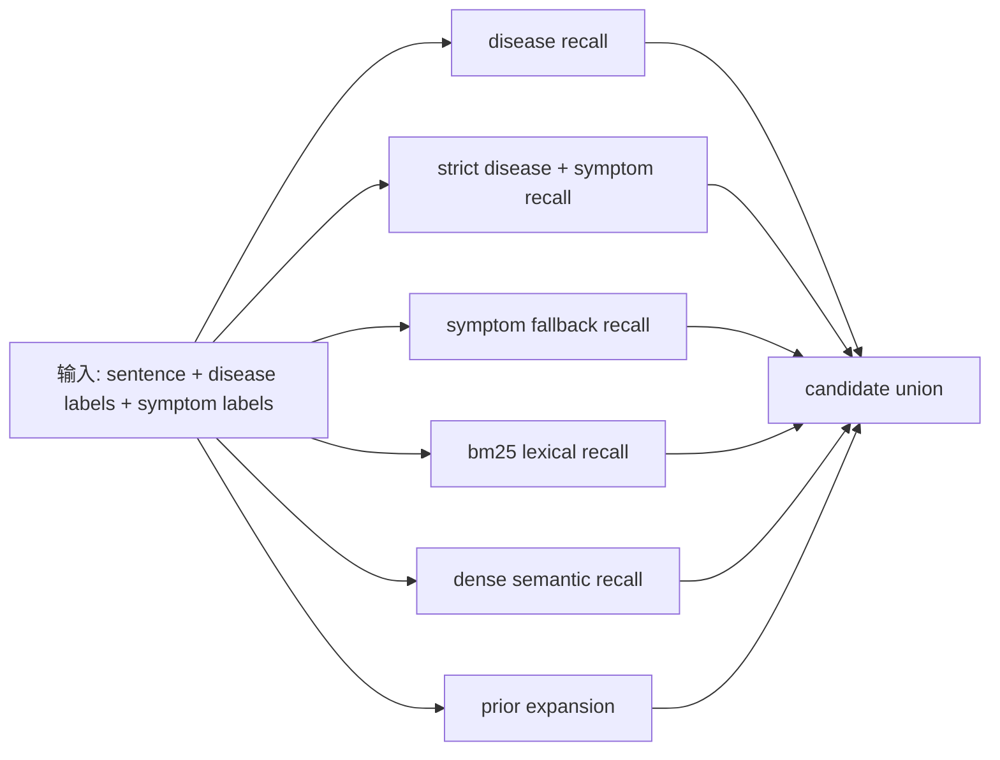
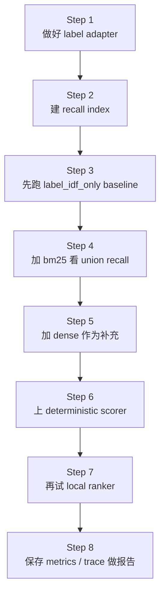
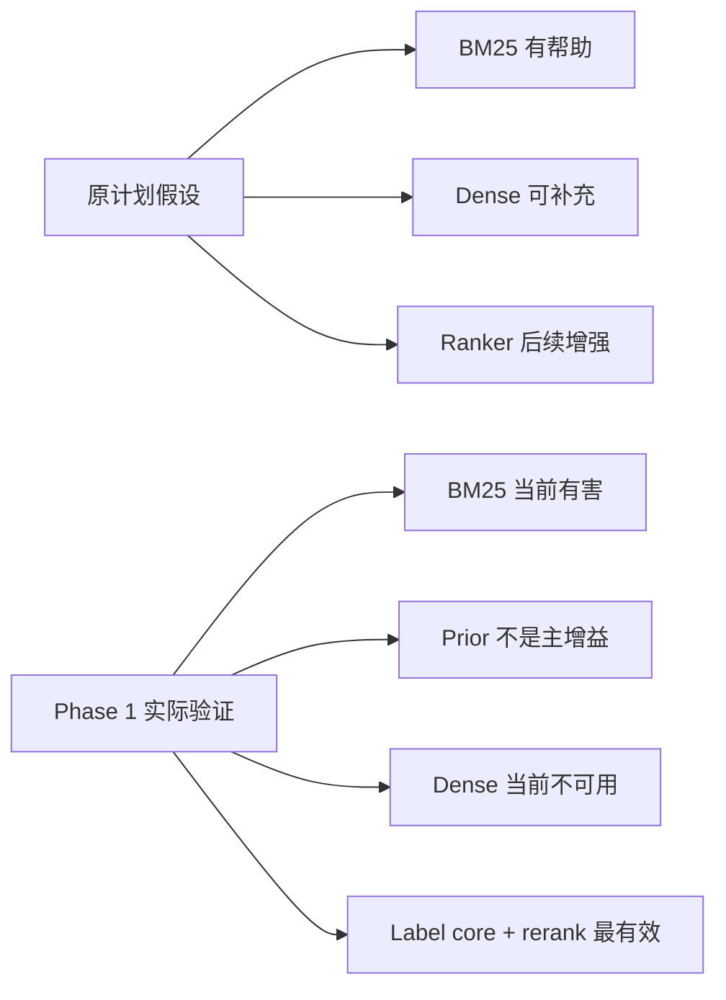
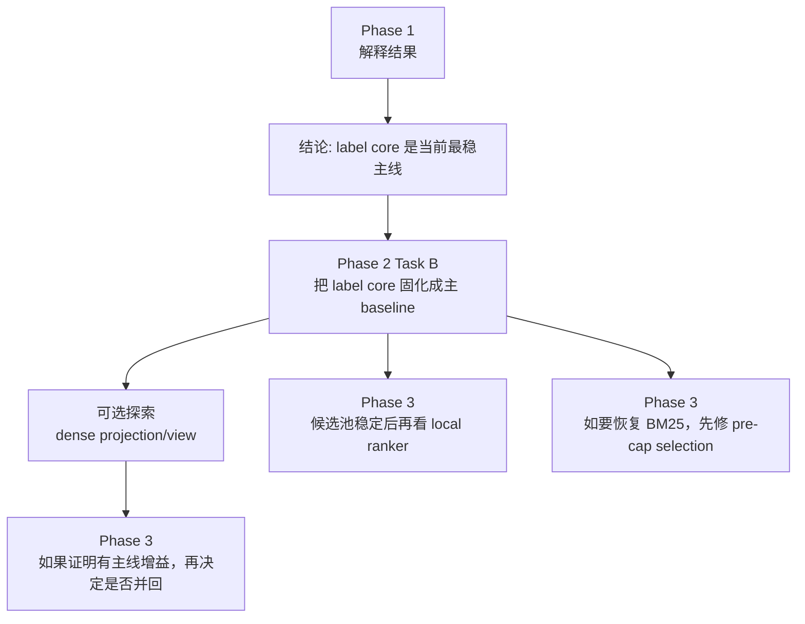

# 实验药物召回大计划 图解版

## 这份文档是干什么的

这份文档是对根目录原计划 [EXP_DRUG_RECALL_PLAN.md](EXP_DRUG_RECALL_PLAN.md) 的中文图解解释版。

它的目的不是替换原文，而是把下面三件事讲清楚：

1. 这个大计划到底想做成什么
2. 整条 pipeline 分几层，每层负责什么
3. 现在项目推进到哪里，下一步应该先做什么

---

## 一句话理解大计划

这个大计划的本质是：

**把“用户自然语言 + 上游 disease/symptom 标签”转成一套本地可解释的药物召回系统，并在 verified set 上把 `hit@20` 做到明显高于当前 label baseline。**

它不是单纯做一个新模型，而是要完成一条完整链路：

- 输入适配
- 候选召回
- 特征打分
- 可选 ranker
- 评估与 trace

---

## 大计划总图



---

## 原计划分层解释

## 1. 输入层

原计划默认上游已经有一层 BERT，把自然语言转成：

- `sentence`
- `diseases`
- `symptoms`
- `need_first_aid`

示意：

```json
{
  "sentence": "I have big, painful bumps on my skin that leave scars.",
  "diseases": [{"name": "acne", "confidence": 1.0}],
  "symptoms": [
    {"name": "nodal_skin_eruptions", "confidence": 1.0},
    {"name": "scurring", "confidence": 1.0}
  ],
  "need_first_aid": 0
}
```

这一层不是本计划的主要研发对象。  
本计划从 **“标签已经出来了”** 之后开始接。

---

## 2. Index 层

原计划第二层是把药物表做成本地可检索索引。

主要数据源：

- `match_data_preprocessing/data/enhanced_drug_table_v1_structured.csv`

要建的索引包括：

- `disease -> rows`
- `symptom -> rows`
- `generic_name -> rows`
- `drug_class -> rows`
- `related_drug -> rows`
- BM25 文本索引
- disease / symptom 的 IDF
- 药物质量先验 `quality prior`
- embedding 资产检查信息

这层的作用是：  
**后面所有召回方式都从这里拿候选。**

---

## 3. 候选召回层

原计划最核心的一层，是把“可能正确的药”先尽量召回来。

原设计里有 6 路：



它们的原始职责分别是：

- `disease`: 最强基础召回
- `strict`: disease + symptom 的高精度召回
- `symptom`: 防 disease 预测错
- `bm25`: 处理文本 lexical 匹配
- `dense`: 处理语义相似
- `prior`: 用 generic / related / high-quality disease-group 做扩展

---

## 4. 打分层

候选被召回后，不是直接输出，而是做 explainable scoring。

原计划里主要特征有：

- disease overlap
- symptom overlap
- symptom IDF
- symptom coverage
- disease specificity
- BM25 score
- dense cosine
- quality prior
- stage hit flags
- others penalty

默认 deterministic score 原计划是：

```text
score =
  0.40 * label_idf_score
+ 0.20 * symptom_coverage
+ 0.15 * bm25_score
+ 0.15 * dense_score
+ 0.10 * quality_prior
- others_penalty
```

这层的目标是：

**即使没有 ranker，也能先靠机械规则把相关药物排到前面。**

---

## 5. Ranker 层

原计划最后还预留了一层 `local learning-to-rank`。

思路是：

- 用弱监督数据训练一个本地 ranker
- 输入还是上一步那些 explainable features
- 如果 ranker 好用，就用 ranker 排序
- 如果 ranker 不稳定，就回退 deterministic scorer

所以 ranker 在原计划里不是基础层，而是：

**后加分项，不是系统成立的前提。**

---

## 原计划的理想推进顺序

原文件里实际隐含的是这个顺序：



也就是说，原计划默认设想是：

- BM25 有机会成为正向增益
- dense 有机会成为正向补充
- ranker 最后做强化

---

## 为什么后来要插一个 Phase 1 Aside

因为实际跑出来以后，情况和原计划假设不完全一样。

我们在 [EXP_DRUG_RECALL_PHASE1.md](EXP_DRUG_RECALL_PHASE1.md) 已经记录了：

- `label_idf_only` 和 `yinan label-only` 基本同一水平
- `bm25` 当前不是增益，而是负贡献
- `prior` 不是当前主增益来源
- `dense` 当前不可用
- `no_bm25 / no_prior_no_bm25` 的大提升主要来自 label-core rerank，而不是新召回源

所以原计划虽然方向没错，但推进顺序需要调整。

---

## 当前状态图



---

## 现在应该怎样理解这个大计划

可以把它拆成两部分：

### 一部分是“结构上正确”

这些内容仍然成立：

- 先做 label adapter
- 先做 recall index
- 先把候选召回来
- 再做 explainable scoring
- 再看要不要加 ranker
- 全程产出 metrics / trace

### 另一部分是“当前实现优先级要调整”

这些内容现在不能照原顺序直接推进：

- `bm25` 不能先当默认增强
- `dense` 不能先当默认增强
- `prior` 不能先当默认增益来源
- `ranker` 不该在候选层没稳定前就推进

---

## 当前推荐推进顺序

按现在的结果，建议把大计划重新理解成下面这条路：



换成白话就是：

1. 先把 `label core` 固化成主线
2. `dense` 默认不进主线，只作为可选探索
3. `BM25` 暂停，不进主线
4. `ranker` 后置

---

## 现在的主线应该是什么

当前最值得理解成“主 baseline”的其实不是 `candidate_union`，而是：

**`label core + deterministic rerank`**

也就是：

- 候选只来自：
  - `disease`
  - `strict`
  - `symptom`
- 然后用 deterministic scorer 重排

这条线为什么重要：

- 不依赖 `bm25`
- 不依赖 `prior`
- 不依赖 `dense`
- 解释清楚
- 已经在 Phase 1 中被证明有效

---

## 用一句话理解原大计划和现在的差别

### 原大计划

“把 label、BM25、dense、prior 都接进来，做 candidate union，再尝试 ranker。”

### 现在更合适的执行版本

“先把 label core 做扎实并主线化，再分别决定 dense 是否值得探索，BM25 要不要重新设计，ranker 要不要后加。”

---

## 你现在只需要记住的 4 句话

1. 原大计划的结构没错，错的是当时默认假设 `bm25/dense` 会帮忙
2. 当前真正有效的主线是 `label core + deterministic rerank`
3. `dense` 默认不进主线，不能直接算主线增益
4. `BM25` 现在先别进主线，除非先修它和 cap 的交互问题

---

## 对应文件地图

如果你后面要看代码，按下面这个地图理解最省力：

- 原计划：  
  [EXP_DRUG_RECALL_PLAN.md](EXP_DRUG_RECALL_PLAN.md)

- Phase 1 结果记录：  
  [EXP_DRUG_RECALL_PHASE1.md](EXP_DRUG_RECALL_PHASE1.md)

- 实验主 pipeline：  
  [app/embedded_module/experimental_recall_pipeline.py](app/embedded_module/experimental_recall_pipeline.py)

- 评估 runner：  
  [app/evaluation/run_exp_drug_recall.py](app/evaluation/run_exp_drug_recall.py)

- aside 对比结果：  
  [artifacts/exp_drug_recall/comparison_summary.md](artifacts/exp_drug_recall/comparison_summary.md)

- Task A sanity check：  
  [artifacts/exp_drug_recall/ablation_sanity_check.md](artifacts/exp_drug_recall/ablation_sanity_check.md)

---

## 当前一句话结论

**原大计划可以继续用，但执行顺序要改成：先主线化 label core，dense 只保留为可选探索，BM25 暂停，ranker 后置。**
