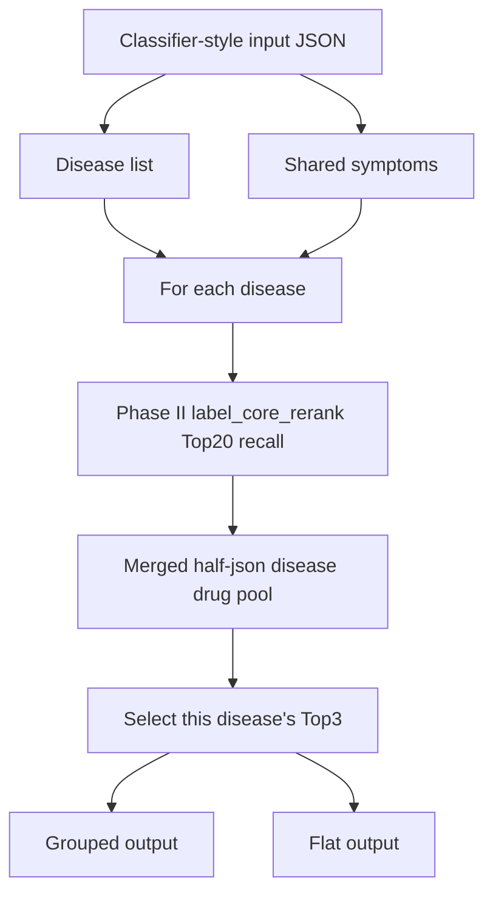

# Phase II Whole Pipeline: Standalone Final Drug Recommendation

## 1. Current Status

Phase II is now implemented as a standalone final recommendation pipeline.

This pipeline is callable from the command line and from Python code, but it has
not been integrated into the FastAPI service yet.

Important boundary:

```text
Standalone Phase II final pipeline:
  app/evaluation/run_phase2_final_recommendation.py

FastAPI production service:
  app/fastapi_module/service.py
  still uses the older DualRecallDrugRecommender + CrossEncoderReranker path
```

So for Phase II final results, call the standalone script. Do not call the
FastAPI endpoint yet if the goal is to use this new Phase II final pipeline.

## 2. Architecture

The pipeline has two stages.



For each input query:

1. Read all diseases from `diseases`.
2. Read all symptoms from `symptoms`.
3. Treat symptoms as shared symptoms for the whole query.
4. For each disease, run a separate Phase II Top20 recall.
5. For that disease only, filter the Top20 through the merged half-json disease
   drug pool.
6. Output Top3 drugs per disease.

The output count is therefore:

```text
1 disease  -> up to 3 recommendations
2 diseases -> up to 6 recommendations
3 diseases -> up to 9 recommendations
```

There is no cross-disease global reranking.
There is no second-stage weighted `selection_score`.

## 3. Implementation Files

Main standalone entrypoint:

```text
app/evaluation/run_phase2_final_recommendation.py
```

Core recommender:

```text
app/embedded_module/phase2_final_recommender.py
```

Phase II recall implementation reused by the final recommender:

```text
app/embedded_module/experimental_recall_pipeline.py
```

Half-data helper reused for canonical drug-name mapping:

```text
app/evaluation/half_data_adapter.py
```

Drug table:

```text
match_data_preprocessing/data/enhanced_drug_table_v1_structured.csv
```

Default half JSON files used by the current CLI:

```text
app/dataset_module/drugs_training_dataset/drug_data_half_1.json
app/dataset_module/drugs_training_dataset/drug_data_half_2.json
```

## 4. Recommendation Logic

For each disease in one query:

1. Build a disease-specific Phase II query:

   ```text
   one disease + all shared symptoms + sentence
   ```

2. Run Phase II recall:

   ```text
   ExperimentalDrugRecallPipeline.recommend(
       mode="label_core_rerank",
       top_k=20,
       pool_size=1000
   )
   ```

3. Keep the returned Phase II rank order.

4. Build the half-confirmed candidate list:

   ```text
   candidate drug is in this disease's merged half-json pool
   ```

5. Select final Top3:

   - First choose half-confirmed drugs in original Phase II rank order.
   - Mark them as `selection_source = "half_confirmed"`.
   - If fewer than 3 are found, fill the remaining slots from the same Phase II
     Top20 in original rank order.
   - Mark fallback drugs as `selection_source = "phase2_fallback"`.

6. Concatenate disease-level results for display only.

`global_display_rank` is only a display index after concatenation. It is not a
global model score.

## 5. Input Format

The expected input follows the classifier-style output.

Symptoms are shared at the query level. They are not separated by disease.

Single query:

```json
{
  "diseases": [
    {
      "label": "gastroenteritis",
      "confidence": 0.59
    }
  ],
  "symptoms": [
    {
      "label": "diarrhoea",
      "confidence": 0.34187650582049783
    },
    {
      "label": "mild_fever",
      "confidence": 0.6203438056388872
    }
  ],
  "need_first_aid": 0,
  "sentence": "A bit of fever with diarrhea and feeling sick. Is this common?"
}
```

Batch input:

```json
[
  {
    "diseases": [
      {"label": "gastroenteritis", "confidence": 0.59},
      {"label": "common_cold", "confidence": 0.31}
    ],
    "symptoms": [
      {"label": "diarrhoea", "confidence": 0.34},
      {"label": "mild_fever", "confidence": 0.62}
    ],
    "need_first_aid": 0,
    "sentence": "A bit of fever with diarrhea and feeling sick. Is this common?"
  }
]
```

Field usage:

- `diseases[].label`: used to run one recommendation pass per disease.
- `diseases[].confidence`: preserved as metadata; not used for ranking.
- `symptoms[].label`: shared symptoms used in each disease's Phase II recall.
- `symptoms[].confidence`: preserved as metadata; not used for ranking.
- `sentence`: passed into recall and preserved in output.
- `need_first_aid`: ignored by this drug recommendation pipeline.

## 6. How To Call

### Debug CLI Call

From repo root:

```bash
python -m app.evaluation.run_phase2_final_recommendation \
  --diseases gastroenteritis common_cold \
  --symptoms diarrhoea mild_fever
```

### Input JSON Call

```bash
python -m app.evaluation.run_phase2_final_recommendation \
  --input-json data/sample_phase2_final_queries.json \
  --output-json artifacts/phase2_final_recommendations/results.json
```

### Useful Optional Arguments

```bash
--top-k-recall 20
--top-k-per-disease 3
--table-path match_data_preprocessing/data/enhanced_drug_table_v1_structured.csv
--half1-path app/dataset_module/drugs_training_dataset/drug_data_half_1.json
--half2-path app/dataset_module/drugs_training_dataset/drug_data_half_2.json
```

The default behavior is already:

```text
top_k_recall = 20
top_k_per_disease = 3
```

## 7. Output Format

The script returns both grouped and flat views.

Grouped view:

```json
{
  "queries": [
    {
      "query_index": 0,
      "sentence": "Debug query",
      "shared_symptoms": [
        {"label": "diarrhoea", "confidence": 1.0},
        {"label": "mild_fever", "confidence": 1.0}
      ],
      "disease_results": [
        {
          "disease": "gastroenteritis",
          "disease_confidence": 1.0,
          "phase2_top20_count": 20,
          "half_confirmed_in_top20": 2,
          "final_top3": [
            {
              "drug_name": "neomycin",
              "disease_rank": 1,
              "phase2_rank": 11,
              "phase2_score": 0.7993470395507283,
              "half_disease_confidence": 0.8,
              "matched_diseases": ["gastroenteritis"],
              "matched_symptoms": ["diarrhoea", "mild fever"],
              "selection_source": "half_confirmed"
            }
          ]
        }
      ]
    }
  ]
}
```

Flat view:

```json
{
  "recommendations": [
    {
      "query_index": 0,
      "disease": "gastroenteritis",
      "disease_confidence": 1.0,
      "drug_name": "neomycin",
      "disease_rank": 1,
      "global_display_rank": 1,
      "phase2_rank": 11,
      "selection_source": "half_confirmed",
      "phase2_score": 0.7993470395507283,
      "half_disease_confidence": 0.8
    }
  ]
}
```

Important output fields:

- `phase2_top20_count`: number of internal Phase II recall candidates returned.
- `half_confirmed_in_top20`: number of Top20 candidates found in the same
  disease's merged half pool.
- `final_top3`: final recommendation list for that disease.
- `disease_rank`: rank inside that disease's Top3.
- `global_display_rank`: display order after concatenating disease results.
- `selection_source`: `half_confirmed` or `phase2_fallback`.
- `phase2_score`: original Phase II `label_core_rerank` score.
- `half_disease_confidence`: half-data evidence score when available.

## 8. Current Verification

Static check:

```bash
python -m py_compile \
  app/embedded_module/cross_encoder_reranker.py \
  app/embedded_module/__init__.py \
  app/embedded_module/phase2_final_recommender.py \
  app/evaluation/run_phase2_final_recommendation.py
```

Smoke test:

```bash
python -m app.evaluation.run_phase2_final_recommendation \
  --diseases acne common_cold \
  --symptoms cough mild_fever \
  --output-json /tmp/phase2_final_smoke.json
```

Observed smoke result:

```text
queries: 1
flat recommendations: 6
acne: 3 final drugs
common_cold: 3 final drugs
selection_score present: false
```

## 9. Known Boundaries

- This pipeline is not integrated into FastAPI yet.
- Production FastAPI still uses `DualRecallDrugRecommender` and
  `CrossEncoderReranker`.
- The standalone Phase II final pipeline does not use cross encoder scoring.
- `cross_encoder_reranker.py` may still be imported indirectly by old production
  modules, but it is not part of this Phase II final recommendation logic.
- The current pipeline is for project recommendation output, not clinical
  decision making.
