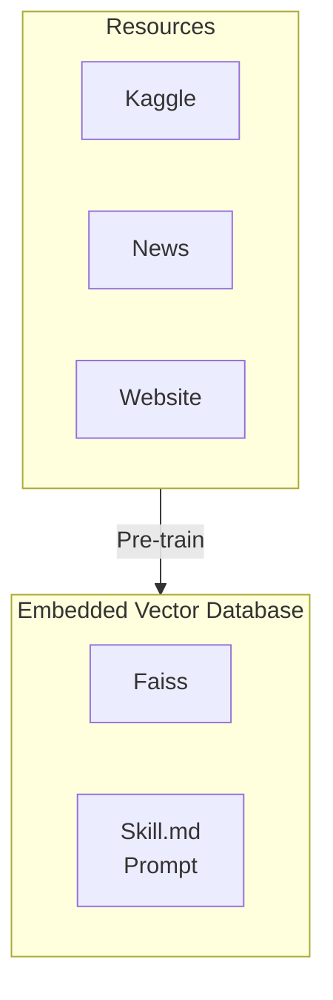

# ARIN7102_Group_Project

For ARIN7102 group project

```mermaid
flowchart TB
 subgraph s1["Resources"]
        s1_1["Kaggle"]
        s1_2["News"]
        s1_3["Website"]
  end

  subgraph s2["Embedded Vector Database"]
    s2_1["Faiss"]
    s2_2["Skill.md<br>Prompt"]
  end

    

  s1--"Pre-train"-->s2


```
