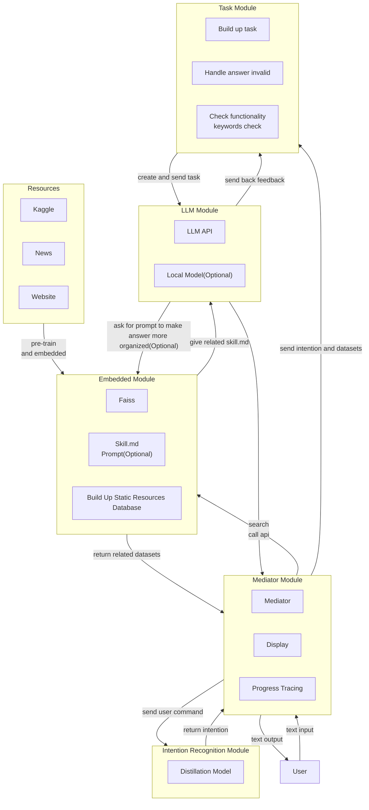

# ARIN7102_Group_Project

For ARIN7102 group project

## Target: Implementation of Medical Query

1. Situation Analysis  
   - Emergency Department  
     - Poisoning  
     - Rusty object cuts  
     - Major bleeding from ruptured blood vessels  
   - Surgery Department  
     - Fractures  
   - Internal Medicine  
     - Common cold  
     - Fever  
     - Dizziness  
     - Headache  
     - Diarrhea  
   - Acute Diseases  
     - Food poisoning  
   - Chronic Diseases  
     - Joint inflammation  
   - Severity of Condition  
     - Benign  
     - Intermediate stage  
     - Terminal stage  
     - Requires urgent medical intervention  
   - Health Consultation  
     - Diet  
     - Lifestyle habits  

2. Treatment Plan
   - Treatment Risks  
     - Mortality rate  
     - Recovery rate  
     - Disease recurrence  
     - Treatment side effects  
       - Amputation  
       - Organ damage  
       - Functional impairment  
       - Psychological trauma  
       - Social and ethical acceptance  
   - Cost  
     - High (treatment cost exceeds 30% of average income per treatment cycle)  
     - Low (treatment cost is below 10% of average income per treatment cycle)  
   - Treatment Duration  
     - Long (measured in years)  
     - Moderate (measured in months)  
     - Short (measured in days)  
   - Preferential Policies  
     - Covered by medical insurance  

3. Medication Recommendations  
   - Drug Classification  
     - Prescription drugs  
     - Over-the-counter drugs  
   - Drug Functions  
     - Primary treatment for conditions  
     - Side effects  
       - Risks  
       - Duration of side effects  
   - Drug Composition  
     - Traditional Chinese medicine  
     - Western medicine  
   - Drug Effectiveness/Treatment Duration  
     - Long (measured in years)  
     - Moderate (measured in months)  
     - Short (measured in days)  
   - Administration Method (Follow doctor's instructions)  
     - Topical application  
     - Oral intake  
     - Intravenous injection
